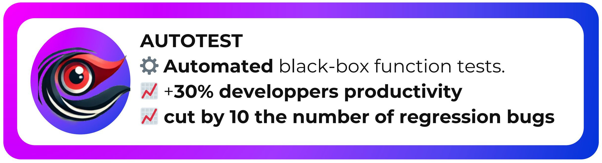
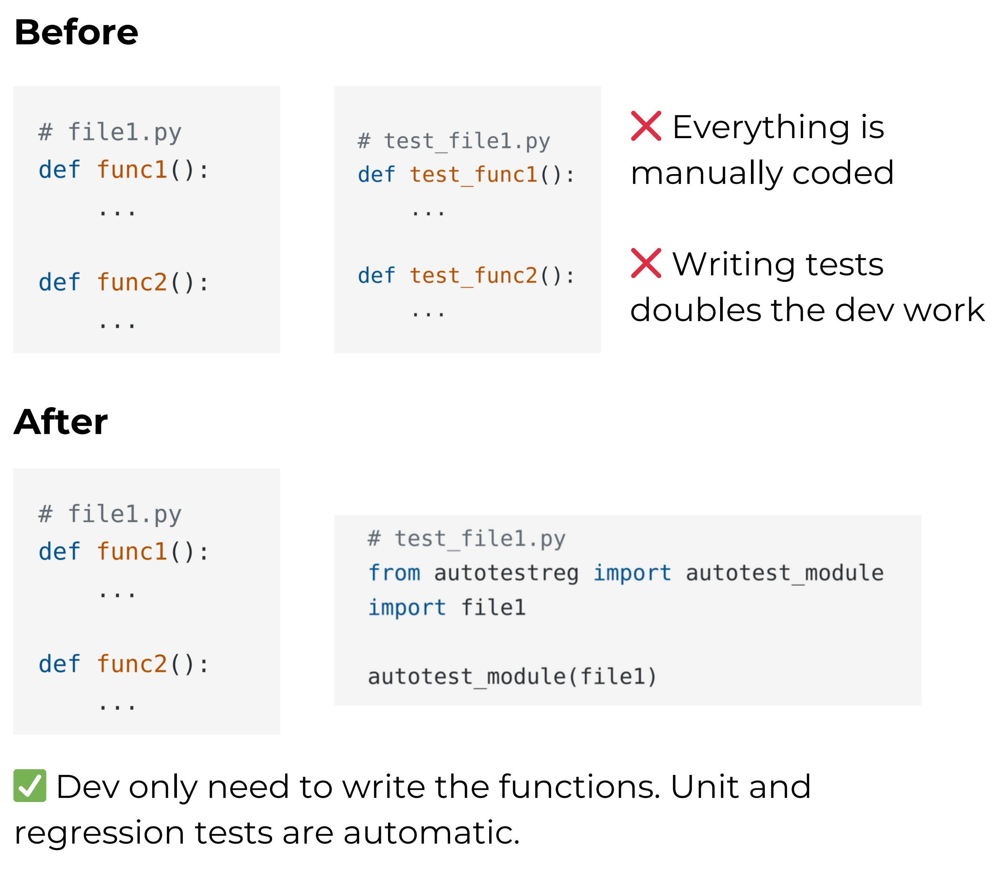
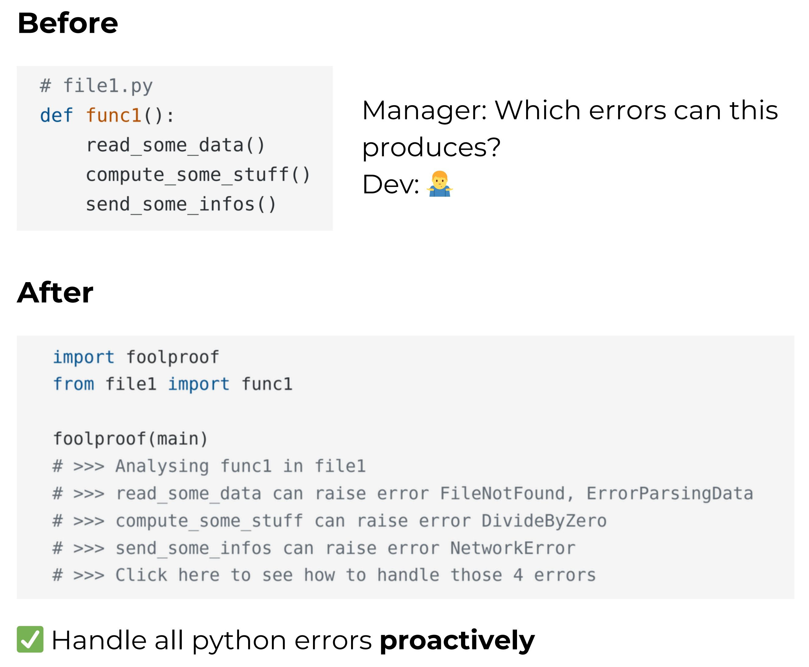

# Autotest! Reg
[autotestreg](https://github.com/RobustPy/autotestreg) to automatically test your functions to see if you have changed their behavior by mistake!

# Foolproof
[foolproof](https://github.com/RobustPy/foolproof) can proactively find all the exceptions that your code and its dependencies can raise, to make your work foolproof!

# Premium Functionalities

See more on [our website](https://sites.google.com/view/robustpy/)
